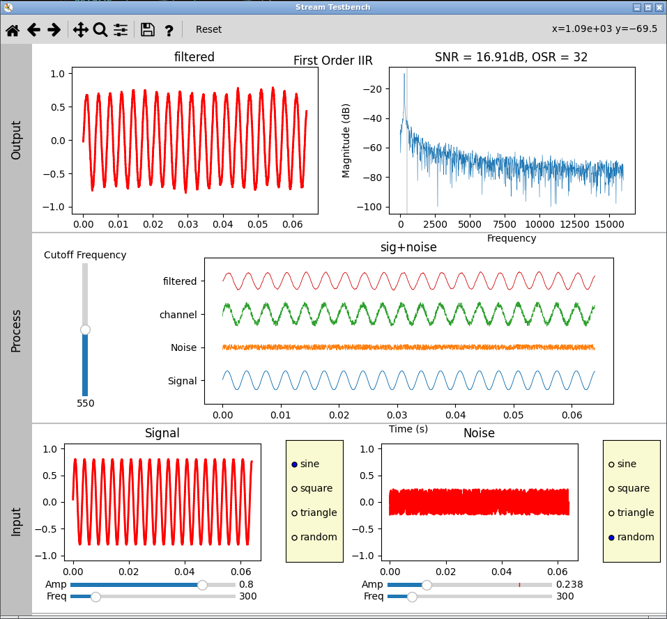

# StreamTestBench
A Python Test Bench for prototyping and visualizing stream-based
Signal Processing blocks.

  

While exploring some simple signal processing concepts
on a small flash based 8bit microcontroller I found I was
loosing momentum spinning in the burn-and-learn cycle. 
Derived from Harnesser's 
[delta-sigma-py](http://github.com/Harnesser/delta-sigma-py)
project, 
[StreamTestBench](http://github.com/coburnw/StreamTestBench) 
attempts to isolate the signal 
processing block under investigation from both the testbench and
the hardware so the developer can stay focused on what is important,
the algorithm itself.

## Instruments
* **function generator** with sine, square, triangle, and random stream generation.
* **spectrum analyzer** for displaying a single stream.
* **xy display** for scope like visualization of a single stream.
* **testpoints** for multi-stream display with a shared time axis.

## Blocks
A Block is a single element in a signal processing chain that processes
a stream of data.  It is a container for the algorithms and 
code that the investigator is exploring.  Inherit from it and add code
necessary to explore the algorithm needed.  The example blocks
will give a good starting point.

### example blocks
* **blocks/dsm.py** Various Delta Sigma Modulators
* **blocks/math.py** Multiply, addition, and inversion
* **blocks/filters.py** Single pole IIR low pass filters

## Data
### Streams
All blocks get their input from and send their output to streams.
The Stream class contains a numpy time array, a sample array, and
the metadata needed by the blocks for processing the
stream data.  In addition, the Stream class is derived from a Listener
which handles the work of shuffling the streams between blocks using
an event system, placing very few requirements on the prototype.

The native stream type is float and seems well-behaved. A rather
crass and incomplete attempt at integer support is included and 
needs a complete overhaul. 

### Parameters
A Parameter is analogous to a single element stream.  Parameters contain
a single value that remains constant through the processing of a stream
of samples.  Corner frequency or filter coefficients would be good
examples of parameters.  Like the Stream class, Parameter is derived 
from a Listener and will alert its users to change.  The filter.py 
example makes use of a slider parameter for setting corner frequency.

# install
Altho installing isnt necessary, it allows a user's test-bench
to be associated with their project rather than the clone.
* activate a venv
* `pip install matplotlib`
* `git clone https://github.com/coburnw/StreamTestBench.git`
* `cd StreamTestBench`
* `pip install --editable .` # note the trailing dot to indicate current directory
* `pip uninstall StreamTestBench` # to remove

Installing as editable make any changes to the repository, including
git pull updates, take effect immediately.

# use
All wiring and configuration of the testbench is done at the python
level.  Use the included example applications as a starting point.

A Reset Button is provided to reload the `modulators.py` module,
so a small bit of live-coding can happen without having to kill and
reload the Matplotlib window.  Altho the reset button functions as 
expected, the importlib.reload does not fit with the new structure.
This is a nice feature that needs to be reimplemented.

# caveats
* fft and snr code is from the original dsm focused project.  Blindly
applying it to a generic stream as attempted here may not be wise.
* signal processing, or math for that matter, are not of my
strong suits.  The user would be remiss to think their results might
represent reality without serious validation on their part.

# Acknowlegements
* StreamTestBench is derived from
  [delta-sigma-py](https://github.com/Harnesser/delta-sigma-py)
without which I would still be downloading to flash and cursing with
each slip of the scope probe.

# todo
* Add true integer support to the Stream class
* Over Sampling Ratio is erratically supported
* Investigate allowing stream meta change in gui
* Generalize spectrum analyzer and validate
* Scale internal waveforms better
* Plot a zoom-in of the baseband
* Calculate the SNR over the baseband
* Allow to store a previous FFT, and plot with the
  latest for easy comparisons

